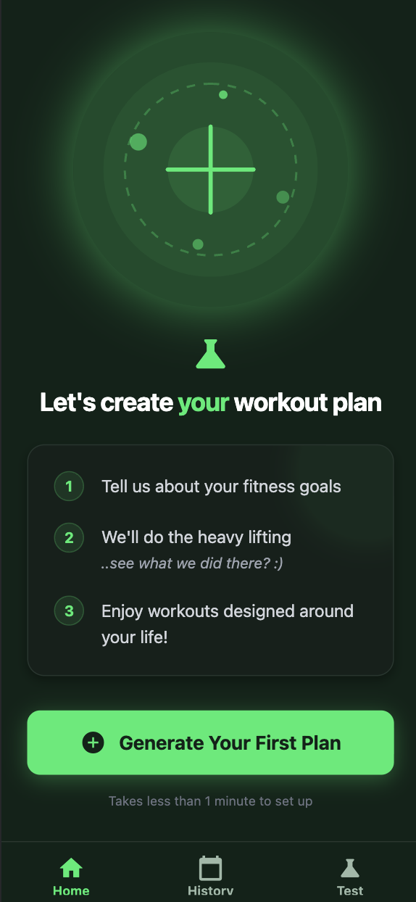

# Workout App

<table>
<tr>
<td width="60%">

_"Workout a day, keeps doctor away"_

A fitness/workout planning and tracking application built with Expo (React Native) for web and iOS platforms.

> **🚧 Beta Forever Badge**
> 
> 1. This started as a learning project and it probably shows! 
> 1. Security bugs are likely chilling in the codebase, mobile testing has been... let's call it "selective"
> 1. There's no backend because who needs one? Just backup and restore your data locally like it's 2010.

Workout App helps you design, track, and analyze your fitness journey with three core capabilities. Create personalized workout plans through an intuitive wizard that generates scientifically-backed programs based on your weekly frequency, available equipment, and training focus. Choose between hypertrophy, strength, or endurance goals, and select program durations from 4 to 12 weeks.

Track your workouts in real-time with an easy-to-use interface that logs sets, reps, and weights while showing your previous performance data to help you progressively overload. Review your fitness progress with a comprehensive history calendar that visualizes completed workouts. View detailed exercise-specific charts that track your strength gains over time.

</td>
<td width="40%">



</td>
</tr>
</table>

## Features

### Plan Creation Wizard

A 5-step wizard generates personalized workout plans:

1. **Frequency** - Choose 2-5 training days per week (determines training split)
2. **Equipment** - Select available equipment: barbells, dumbbells, cables, machines, kettlebells, or bodyweight
3. **Training Focus** - Pick your goal: Strength (5x3-5 reps), Balanced (3x8-12), or Endurance (3x15-20)
4. **Exercise Review** - Customize exercises per muscle group: swap alternatives, add extras, or remove
5. **Plan Review** - Reorder exercises with drag-and-drop, set program duration (4-12 weeks)

**Training Splits** (auto-selected based on frequency):
- 2-3 days/week → Full Body
- 4 days/week → Upper/Lower
- 5+ days/week → Push/Pull/Legs

### Workout Tracking

- **Set Logger** - Tap +/- buttons to adjust weight, reps per set
- **Auto-prefill** - Completed set values copy to next set automatically
- **Previous Performance** - See last session's numbers for each exercise
- **Pause/Resume** - In-progress workouts save automatically, continue anytime
- **Personal Records** - Tracks your max weight per exercise

### Progress Analytics

- **History Calendar** - Monthly view with workout days highlighted
- **Workout Streaks** - Track consecutive training days
- **Progress Charts** - Per-exercise weight progression over time

### Data Management

- **Local Storage** - All data persisted on-device via AsyncStorage
- **Backup/Restore** - Export all data to JSON file, import on any device
- **No Account Required** - Zero backend, zero signup, your data stays yours

### Exercise Library

108+ exercises covering 6 muscle groups (Chest, Back, Shoulders, Arms, Legs, Core) across 6 equipment types. The generator uses smart muscle distribution to ensure proper recovery between sessions.

## Tech Stack

- **Framework**: Expo SDK 54 with React Native
- **Language**: TypeScript (strict mode)
- **Routing**: Expo Router (file-based routing)
- **Styling**: NativeWind v4 (Tailwind CSS for React Native)
- **Storage**: AsyncStorage with in-memory caching
- **Backup**: expo-file-system, expo-document-picker, expo-sharing
- **Drag & Drop**: @dnd-kit (web), react-native-draggable-flatlist (native)
- **Charts**: Custom SVG-based ProgressChart component
- **Testing**: Jest + React Native Testing Library
- **Icons**: MaterialIcons from @expo/vector-icons
- **Fonts**: Lexend (display), Noto Sans (body)

## Prerequisites

- **Node.js**: >= 20.0.0 (required for Metro bundler compatibility)
- **npm**: Comes with Node.js
- **nvm** (optional but recommended): For managing Node versions

## Getting Started

### 1. Install Node.js 20+

If you're using nvm:

```bash
nvm install 20
nvm use 20
```

Otherwise, download and install Node.js 20+ from [nodejs.org](https://nodejs.org/).

### 2. Install Dependencies

```bash
npm install
```

### 3. Start Development Server

```bash
npm start
```

This will start the Expo development server. You can then:
- Press `w` to open in web browser
- Press `i` to open in iOS simulator (macOS only)
- Press `a` to open in Android emulator
- Scan the QR code with Expo Go app on your phone

## Available Commands

```bash
npm start              # Start Expo dev server (interactive)
npm run web            # Start for web directly
npm run ios            # Start for iOS simulator
npm run android        # Start for Android emulator

npm test               # Run tests once
npm run test:watch     # Run tests in watch mode
npm run test:coverage  # Run tests with coverage report

npm run typecheck      # Run TypeScript type checking
```

## Project Structure

```
workout-app/
├── app/                    # Expo Router routes (file-based routing)
│   ├── (tabs)/            # Tab navigation: home, history, settings
│   ├── wizard/            # 5-step plan creation wizard
│   ├── workout/           # Workout plan detail view
│   ├── session/           # Active workout tracking
│   ├── exercise/          # Exercise history and progress charts
│   └── _layout.tsx        # Root layout with fonts and navigation
├── components/
│   ├── ui/                # Reusable UI components (Button, Card, etc.)
│   ├── SetTracker.tsx     # Weight/reps logging component
│   ├── ProgressChart.tsx  # SVG line chart for progress
│   ├── Calendar.tsx       # Monthly calendar with highlights
│   └── SortableList.tsx   # Drag-drop reordering (platform-specific)
├── lib/
│   ├── storage/           # AsyncStorage wrapper, types, seed data
│   ├── backup/            # JSON export/import functionality
│   ├── workout-generator/ # Plan generation algorithm
│   └── utils/             # Utility functions (cn.ts for classnames)
├── constants/
│   └── theme.ts           # Design tokens and theme configuration
└── global.css             # Global styles for NativeWind
```

### Key Concepts

#### Expo Router File Naming Conventions

- **`(folderName)/`** - Route groups: Parentheses create logical groups without affecting the URL structure
  - Example: `app/(tabs)/index.tsx` → URL: `/`
- **`+filename.tsx`** - Special routes: Plus sign indicates special functionality
  - `+html.tsx` - Custom HTML template for web
  - `+not-found.tsx` - 404 error page
- **`_layout.tsx`** - Layout files: Underscore indicates layout components

#### Path Aliases

Use `@/` for absolute imports:
```typescript
import { Button } from '@/components/ui/Button';
import { cn } from '@/lib/utils/cn';
```

## Testing

### Running Tests

```bash
npm test               # Run all tests
npm run test:watch     # Watch mode for TDD
npm run test:coverage  # Generate coverage report
```

### Testing Conventions

- **NEVER** place test files in `app/` directory - files there become routes
- For components and libraries: place tests next to code
  - Same directory: `Button.tsx` + `Button.test.tsx`
  - Or subdirectory: `Button.tsx` + `__tests__/Button.test.tsx`
- All test files must use TypeScript (`.test.tsx` or `.test.ts`)
- Follow TDD approach: write tests first, then implement features

### Example Test

```typescript
import { render, screen } from '@testing-library/react-native';
import { Button } from './Button';

describe('Button', () => {
  it('renders correctly', () => {
    render(<Button>Click me</Button>);
    expect(screen.getByText('Click me')).toBeTruthy();
  });
});
```

## Design System

### Colors

Configured in `tailwind.config.js`:

```
primary:          #13ec6d (bright green)
background-dark:  #102218
surface-dark:     #1c2e24
text-muted:       #9db9a8
```

### Using Styles

NativeWind allows you to use Tailwind classes directly:

```tsx
import { View, Text } from 'react-native';

export function Card() {
  return (
    <View className="bg-surface-dark p-4 rounded-lg">
      <Text className="text-white font-bold">Hello World</Text>
    </View>
  );
}
```

Use the `cn()` utility to merge classes conditionally:

```tsx
import { cn } from '@/lib/utils/cn';

<Button className={cn('bg-primary', isDisabled && 'opacity-50')} />
```

## Development Workflow

1. **Start dev server**: `npm start` or `npm run web`
2. **Write tests first** (TDD approach): Create test files before implementation
3. **Implement features**: Build components and logic to pass tests
4. **Run tests**: `npm test` to ensure everything works
5. **Type check**: `npm run typecheck` to catch TypeScript errors
6. **Iterate**: Make changes and test immediately with hot reload

## Troubleshooting

### "configs.toReversed is not a function" Error

This means you're using Node.js < 20. Upgrade to Node.js 20+:
```bash
nvm install 20
nvm use 20
```

### "TypeError: fetch failed" on Startup

Use offline mode to bypass network checks:
```bash
npx expo start --web --offline
```

### Tests Not Running

- Ensure test files use `.test.ts` or `.test.tsx` extension
- Check that tests are in `__tests__/` directories or next to code
- Verify tests are NOT in `app/` directory (those become routes)

### Metro Bundler Issues

Clear cache and restart:
```bash
npx expo start -c
```

## Additional Resources

- [Expo Documentation](https://docs.expo.dev/)
- [Expo Router Documentation](https://docs.expo.dev/router/introduction/)
- [NativeWind Documentation](https://www.nativewind.dev/)
- [React Native Documentation](https://reactnative.dev/)

## Deployment

The app is deployed to **Cloudflare Pages** with **Cloudflare Zero Trust Access** for authentication. Infrastructure is managed declaratively using **Terraform**.

### Deploy via Cloudflare Pages (Automatic)

The app automatically deploys to Cloudflare Pages on every push to `main`:

1. **Push to GitHub**: `git push origin main`
2. **Cloudflare Pages builds**: Runs `npm run build:web` automatically
3. **Deploy**: Published to `workout-native.pages.dev`
4. **Access Control**: Protected by Zero Trust Access (Google OAuth)

### Infrastructure as Code (Terraform)

All Cloudflare infrastructure (Pages project, Access application, Access policies) is managed via Terraform in the `terraform/` directory.

#### Quick Start

```bash
cd terraform

# 1. Copy example config and fill in your values
cp terraform.tfvars.example terraform.tfvars

# 2. Set your Cloudflare API token (or add it to terraform.tfvars)
export CLOUDFLARE_API_TOKEN="your-token-here"

# 3. Initialize Terraform
terraform init

# 4. Preview changes
terraform plan

# 5. Apply infrastructure changes
terraform apply
```

#### Test Infrastructure as Code

To verify Terraform correctly manages your infrastructure, try this safe test:

```bash
cd terraform

# Make a small, useful change (reduce session duration for better security)
# Edit main.tf: change session_duration from "12h" to "8h" in
# cloudflare_zero_trust_access_application resource

# Preview the change
terraform plan
# Should show: session_duration = "12h" -> "8h"

# Apply the change
terraform apply

# Verify the change worked:
terraform state show cloudflare_zero_trust_access_application.app | grep session_duration
# Should show: session_duration = "8h"

# Verify in Cloudflare dashboard:
# Zero Trust > Access > Applications > Workout Native
# Should show "Session Duration: 8 hours"

# Optional: revert to 12h if desired
# Edit main.tf back to session_duration = "12h"
# Run: terraform apply
```

This test proves that:
- ✅ Terraform can modify live infrastructure
- ✅ Changes are applied safely (in-place update, non-destructive)
- ✅ State is tracked correctly
- ✅ Cloudflare API responds to Terraform commands

#### API Token Setup

To use Terraform, you need a Cloudflare API token with these permissions:

- **Account: Cloudflare Pages: Edit**
- **Account: Access: Apps and Policies: Edit**
- **Account: Access: Apps and Policies: Read**
- **Account: Workers Scripts: Edit**
- **Account: Workers KV Storage: Edit**
- **Account: Account Settings: Read**
- **Zone: Workers Routes: Edit** (only if using `strava_sync_route_pattern`)

Create your token at: Cloudflare Dashboard → My Profile → API Tokens

Then either:
1. Export as environment variable: `export CLOUDFLARE_API_TOKEN="your-token"`
2. Add to `terraform/terraform.tfvars`: `cloudflare_api_token = "your-token"` (not recommended)

### Strava Sync Backend (Terraform)

Strava sync is implemented with a Cloudflare Worker + KV namespace and managed in Terraform (`terraform/strava_sync.tf`).

1. Apply Terraform once to create Worker + KV (you can keep Strava vars empty at this stage):
   - `cd terraform`
   - `terraform plan`
   - `terraform apply`
2. Get your Worker host from Cloudflare (Workers dashboard), for example:
   - `strava-sync-worker.<subdomain>.workers.dev`
3. Create/update your Strava app:
   - Authorization Callback Domain = Worker host (domain only, no protocol/path)
4. Set Strava variables in local `terraform.tfvars` and re-apply:
   - `strava_client_id`
   - `strava_client_secret`
   - `strava_redirect_uri` = `https://<worker-host>/strava/callback`
   - `strava_callback_success_url` (optional)
   - `strava_sync_api_base_url` = `https://<worker-host>`
   - optionally `strava_sync_route_pattern` and `strava_sync_zone_id` if attaching to a custom domain route
   - run `terraform apply` again so secrets are written to Worker and Pages env vars are updated
5. Trigger a new Pages deployment after the Terraform apply so the new `EXPO_PUBLIC_*` value is baked into the build.

The app Settings screen includes Strava connect/disconnect and an auto-sync toggle.
Each completed set contributes **4 minutes** to Strava activity duration.

## Contributing

1. Follow the TDD approach
2. Write TypeScript for all code
3. Use the design system colors and components
4. Run tests and type checking before committing
5. Keep components focused and reusable

For detailed development guidelines, see [CLAUDE.md](./CLAUDE.md).
